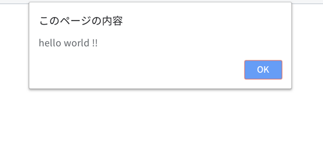

## webpack とは

webpack は現代的な JavaScript アプリケーションの静的モジュールバンドラーです。複数のモジュールからなる JavaScript アプリケーションを1つにまとめます。

## 目標

webpack でビルドできる環境を構築

以下のようなフォルダ構成にします。

```bash
my-project
├── dist/ # 成果物
├── node_modules/ # モジュール
├── src/ # ソースコード
├── package-lock.json
└── package.json
```

## webpack の導入手順

すでに nodejs はインストール済みであると仮定しています。

プロジェクトフォルダの作成、プロジェクト設定情報の作成を行います。

`package.json` ファイルが生成されます。

```bash
mkdir my-project
cd my-project
node init -y
```

次に webpack をプロジェクトにインストールします。ビルドので必要になるだけなので、`--save-dev` オプションを付加します。

```bash
npm install --save-dev webpack webpack-cli

# こちらでもいい
npm i -D webpack webpack-cli
```

生成結果が次のようになります。webpack の導入が完了しました。

```
my-project
├── node_modules/
├── package-lock.json
└── package.json
```

## webpack で JavaScript をバンドルしてみる

webpack の導入がすんだので、webpack を使って複数の JavaScript を1つのファイルにバンドルします。`index.js` から `hello.js` に定義された `hello()`
メソッドを呼び出すプログラムを作成します。

`src` フォルダを作成し、`index.js` と `hello.js` を作成します。

**src/index.js**

```js
import hello from "./hello";

hello();
```

**src/hello.js**

```js
export default function hello() {
    alert("hello world !!");
}
```

ファイルが作成できたら webpack で js ファイルをひとつにまとめます。

```
npx webpack
```

`dist` フォルダが自動で作成され、中には `main.js`が生成されます。

### 動作を確認する

`dist` ファイルに以下のような `html` ファイルを作成すると動作を確認できます。

```HTML
<!DOCTYPE html>
<html>
<head>
    <meta charset="UTF-8">
    <title>Webpack App</title>
</head>
<body>
<script type="text/javascript" src="main.js"></script>
</body>
</html>
```



## weppack.config.js で設定を変える。

webpack.config.js を変更することで、エントリーポイント（プログラムで一番最初に呼ばれる箇所）を変更したり、出力フォルダーや生成ファイルの名前を変更できます。

**webpack.config.js**

```js
const path = require("path");

module.exports = {
    entry: "./path/to/my/entry/file.js",
    output: {
        path: path.resolve(__dirname, "dist"),
        filename: "my-first-webpack.bundle.js"
    }
};
```

## HtmlWebpackPlugin を使って HTML ファイルの自動生成。

さきほどは動作を確認するため `dist` フォルダに直接、html ファイルを用意しました。webpack コマンドを実行したときに自動的に、HTML ファイルを生成するように設定もできます。

### インストール

```bash
npm install --save-dev html-webpack-plugin
```

### 使い方

`html-webpack-plugin` を `requrie()` して、`plugin` として読み込みます。
`src/index.html` をテンプレートとして用意します。

**webpack.config.js**

```js
var HtmlWebpackPlugin = require("html-webpack-plugin");
var path = require("path");

module.exports = {
    entry: "./src/index.js",
    output: {
        path: path.resolve(__dirname, "dist"),
        filename: "main.js"
    },
    plugins: [new HtmlWebpackPlugin({template: "./src/index.html"})]
};
```

**index.html**

```html
<!DOCTYPE html>
<html>
<head></head>
<body></body>
</html>
```

以上のように設定をしビルドします。

```bash
npx webpack
```

すると`dist`のなかに、js のバンドル結果`main.js` を外部読み来るように指定された`index.html` が生成されます。

メリットとしてはわざわざ`dist`の中にファイルを用意する必要がなくなり、プロジェクト管理から`dist`フォルダを排除できることです。

## まとめ

webpack の環境構築についてでした

## 参考

この記事は [https://webpack.js.org/](https://webpack.js.org/) を参考に作成されました。一部翻訳、引用を用いています。
